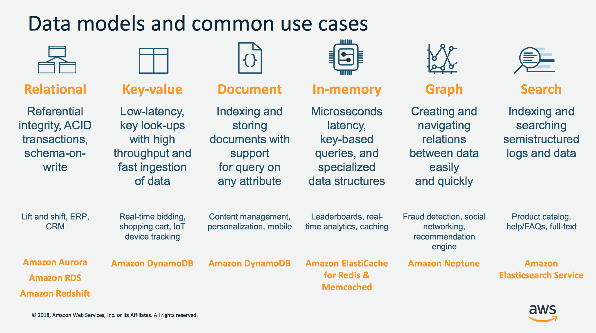

## Purpose-built Databases: Data Models and Common Use Cases

### Summary

### Relational
A relational database is self-describing because it enables developers to define the database's schema as well as relations and constraints between rows and tables in the database. Developers rely on the functionality of the relational database (not the application code) to enforce the schema and preserve the referential integrity of the data within the database. Typical use cases for a relational database include web and mobile applications, enterprise applications, and online gaming. Airbnb is a great example of a customer building high-performance and scalable applications with Amazon Aurora. Aurora provides Airbnb a fully-managed, scalable, and functional service to run their MySQL workloads.

### Key-value 
Key-value databases are highly partitionable and allow horizontal scaling at levels that other types of databases cannot achieve. Use cases such as gaming, ad tech, and IoT lend themselves particularly well to the key-value data model where the access patterns require low-latency Gets/Puts for known key values. The purpose of DynamoDB is to provide consistent single-digit millisecond latency for any scale of workloads. This consistent performance is a big part of why the Snapchat Stories feature, which includes Snapchat's largest storage write workload, moved to DynamoDB.

### Document
Document databases are intuitive for developers to use because the data in the application tier is typically represented as a JSON document. Developers can persist data using the same document model format that they use in their application code. Tinder is one example of a customer that is using the flexible schema model of DynamoDB to achieve developer efficiency.

### Graph
A graph database's purpose is to make it easy to build and run applications that work with highly connected datasets. Typical use cases for a graph database include social networking, recommendation engines, fraud detection, and knowledge graphs. Amazon Neptune is a fully-managed graph database service. Neptune supports both the Property Graph model and the Resource Description Framework (RDF), giving you the choice of two graph APIs: TinkerPop and RDF/SPARQL. Current Neptune users are building knowledge graphs, making in-game offer recommendations, and detecting fraud. For example, Thomson Reuters is helping their customers navigate a complex web of global tax policies and regulations by using Neptune.

### In-memory 
Financial services, Ecommerce, web, and mobile application have use cases such as leaderboards, session stores, and real-time analytics that require microsecond response times and can have large spikes in traffic coming at any time. We built Amazon ElastiCache, offering Memcached and Redis, to serve low latency, high throughput workloads, such as McDonald's, that cannot be served with disk-based data stores. Amazon DynamoDB Accelerator (DAX) is another example of a purpose-built data store. DAX was built is to make DynamoDB reads an order of magnitude faster.

### Search 
Many applications output logs to help developers troubleshoot issues. Amazon Elasticsearch Service (Amazon ES) is purpose built for providing near real-time visualizations and analytics of machine-generated data by indexing, aggregating, and searching semi structured logs and metrics. Amazon ES is also a powerful, high-performance search engine for full-text search use cases. Expedia is using more than 150 Amazon ES domains, 30 TB of data, and 30 billion documents for a variety of mission-critical use cases, ranging from operational monitoring and troubleshooting to distributed application stack tracing and pricing optimization.