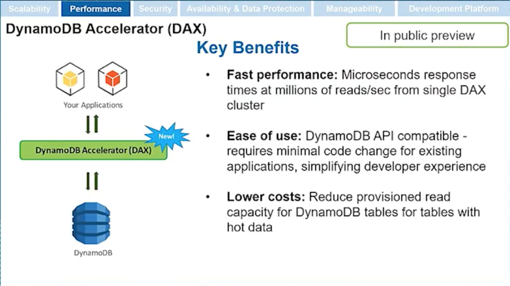
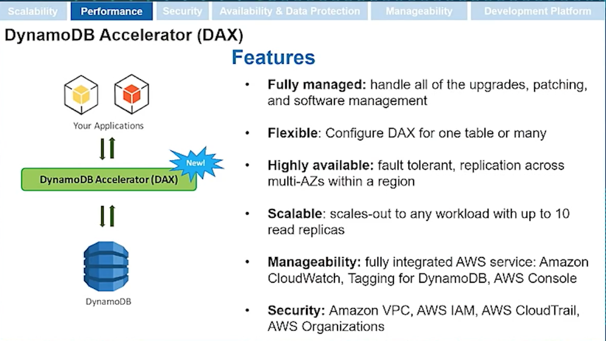
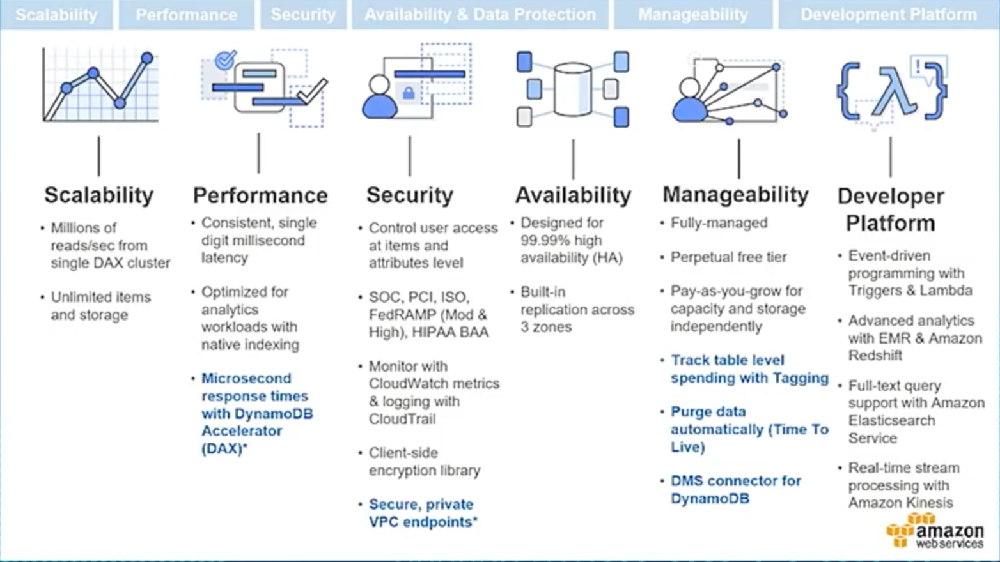

# Amazon DynamoDB Accelerator (DAX)
**Fully managed, in-memory cache for DynamoDB.**

**Reduces DynamoDB response times from milliseconds to microseconds.**

Enter DynamoDB Accelerator. With the launch of DAX, you now get microsecond access to data that lives in DynamoDB. DAX is an in-memory cache in front of DynamoDB and has the identical API as DynamoDB. There's no need to rewrite your applications to access your cache. You just point your existing application at the DAX endpoint, and as a read-through/write-through cache, DAX seamlessly handles caching for you. Microsecond response times, millions of requests per second—and of course, it's a fully managed environment that is highly available over multiple Availability Zones so you no longer have to worry about managing your cache.

## DAX Benefits

## DAX Features

