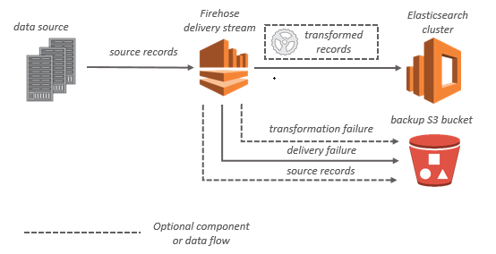
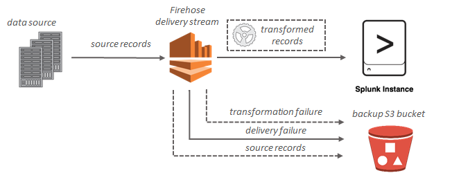

# What Is Amazon Kinesis Data Firehose?

Amazon Kinesis Data Firehose is a fully managed service for delivering real-time streaming data to destinations such as Amazon Simple Storage Service (Amazon S3), Amazon Redshift, Amazon Elasticsearch Service (Amazon ES), and Splunk. Kinesis Data Firehose is part of the Kinesis streaming data platform, along with Kinesis Data Streams, Kinesis Video Streams, and Amazon Kinesis Data Analytics. With Kinesis Data Firehose, you don't need to write applications or manage resources. You configure your data producers to send data to Kinesis Data Firehose, and it automatically delivers the data to the destination that you specified. You can also configure Kinesis Data Firehose to transform your data before delivering it.

## Key Concepts

As you get started with Kinesis Data Firehose, you can benefit from understanding the following concepts:

### Kinesis Data Firehose delivery stream
The underlying entity of Kinesis Data Firehose. You use Kinesis Data Firehose by creating a Kinesis Data Firehose delivery stream and then sending data to it. For more information, see Creating an Amazon Kinesis Data Firehose Delivery Stream and Sending Data to an Amazon Kinesis Data Firehose Delivery Stream.

### record
The data of interest that your data producer sends to a Kinesis Data Firehose delivery stream. A record can be as large as 1,000 KB.

### data producer
Producers send records to Kinesis Data Firehose delivery streams. For example, a web server that sends log data to a delivery stream is a data producer. You can also configure your Kinesis Data Firehose delivery stream to automatically read data from an existing Kinesis data stream, and load it into destinations. For more information, see Sending Data to an Amazon Kinesis Data Firehose Delivery Stream.

### buffer size and buffer interval
Kinesis Data Firehose buffers incoming streaming data to a certain size or for a certain period of time before delivering it to destinations. Buffer Size is in MBs and Buffer Interval is in seconds.

## Data Flow

For Amazon S3 destinations, streaming data is delivered to your S3 bucket. If data transformation is enabled, you can optionally back up source data to another Amazon S3 bucket.

            
For Amazon Redshift destinations, streaming data is delivered to your S3 bucket first. Kinesis Data Firehose then issues an Amazon Redshift COPY command to load data from your S3 bucket to your Amazon Redshift cluster. If data transformation is enabled, you can optionally back up source data to another Amazon S3 bucket.

            
For Amazon ES destinations, streaming data is delivered to your Amazon ES cluster, and it can optionally be backed up to your S3 bucket concurrently.

            
For Splunk destinations, streaming data is delivered to Splunk, and it can optionally be backed up to your S3 bucket concurrently.

