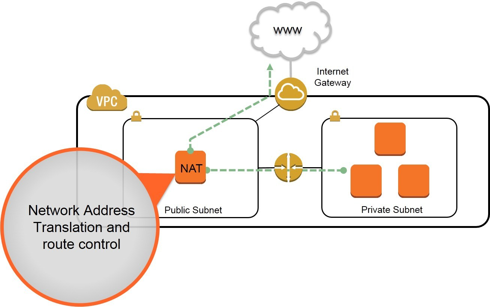
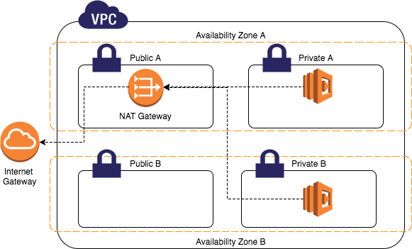
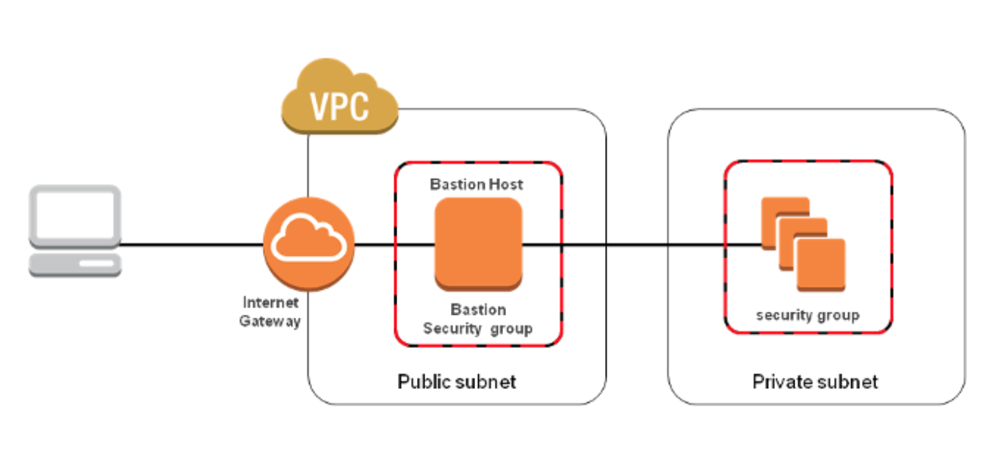

# NAT Gateway vs Bastion Host
## NAT gateway

### What is NAT?

NAT (Network Address Translation) is designed for IP address conservation. It enables private IP networks that use unregistered IP addresses to connect to the Internet.

### How does NAT work?

NAT allows a single device, such as a router, to act as an agent between the Internet and a local network, which means a single unique IP address is required to represent an entire group of computers to public network.

### What is NAT Instance ?

A NAT instance enables instances in the private subnet to initiate _outbound_ traffic to the Internet, but prevent the instances from receiving _inbound_ traffic initiated by someone on the Internet. A NAT instance lives in the public subnet. The main reason to configure NAT instances is to allow private instances to access the Internet for important operating system updates. It is used for purposes like patching your OS etc.

***Note***: NAT Instance is a legacy, You can use NAT Gateway

### What is NAT Gateway ?

NAT Gateway provides the same functionality as a NAT instance, however a NAT Gateway is an AWS managed NAT service. As a result, the NAT Gateway offers greater availability and bandwidth and requires less configuration and administration.

NAT instance:

NAT Gateway:

## Bastion Host
Bastion hosts are instances that sit within your public subnet and are typically accessed using SSH or RDP. Once remote connectivity has been established with the bastion host, it then acts as a ‘jump’ server, allowing you to use SSH or RDP to log in to other instances (within private subnets) deeper within your VPC. When properly configured through the use of security groups and Network ACLs (NACLs), the bastion essentially acts as a bridge to your private instances via the internet.

Bastion host:

### Bastion Host Connectios

SSH and RDP connections require private and public key access to authenticate. This does not pose a problem when you are trying to connect to your bastion host from your local machine, as you can easily store the private key locally. However, once you have connected to your bastion host, logging in to your private instances from the bastion would require having their private keys on the bastion. As you will probably already know (and if not, then take careful note now), storing private keys on remote instances is not a good security practice.

As a result, AWS suggests that you implement either Remote Desktop Gateway (for connecting to Windows instances) or SSH-agent forwarding (for Linux instances). Both of these solutions eliminate the need for storing private keys on the bastion host. AWS provides great documentation on how to implement Windows Remote Desktop Gateway and SSH-agent forwarding.

***Recommendation***: As with all cloud deployments, you should always consider the resiliency and high availability of your services. With this in mind, it is recommended deploying a bastion within each public Availability Zone that you are using. Remember: if the AZ hosting your only AWS bastion host goes down, you will lose connectivity to your private instances in other AZs.

### Linux bastion host architecture on AWS

