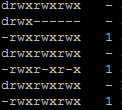

# Replication in Hadoop - Examples


Checking/changing the replication factor in */etc/hadoop/conf/hdfs-site.xml*:

```xml
<property>
    <name>dfs.replication</name>
    <value>3</value>
</property>
```

Checking the replication factor in HDFS:

```sh
hadoop fs -ls /user/hadoop_user1
```

The second column in the output reflects the replication factor for the file and **'-'** for the folder:



Checking the replication factor for a specific file in HDFS:

```sh
hadoop fs -stat %r /user/hadoop_user1/file1.txt
```

Copying a file to HDFS with a specific replication factor:

```sh
hadoop fs -D dfs.replication=5 -copyFromLocal file1.txt /user/hadoop_user1
```

Changing the replication factor for a specific file:

```sh
hadoop fs -setrep -w 5 /user/hadoop_user1/file1.txt
```

Changing the replication factor for all files in a specific folder:

```sh
hadoop fs -setrep -w 5 -R /user/hadoop_user1
```