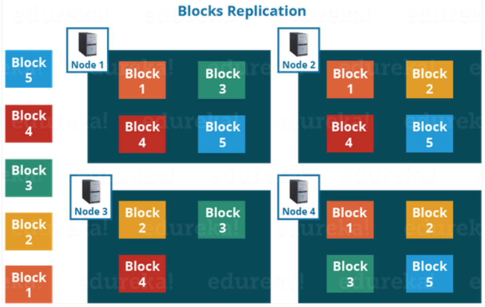
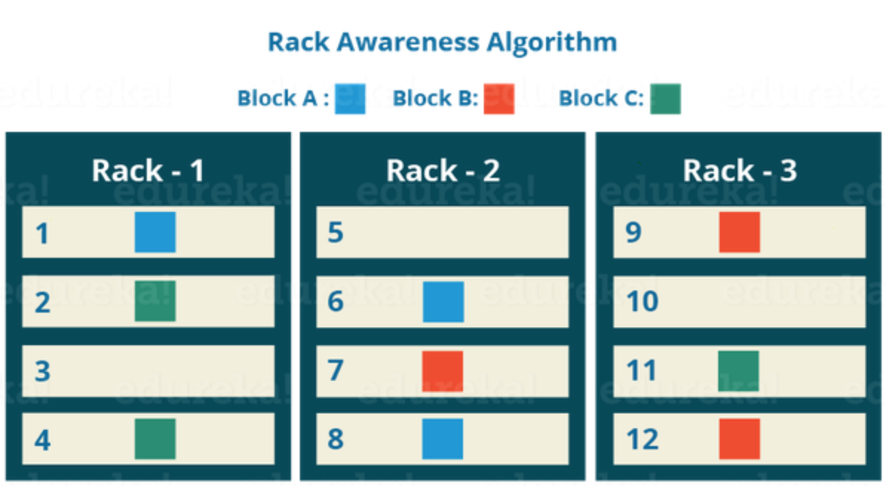

# Replication in Hadoop

HDFS provides a reliable way to store huge data in a distributed environment as data blocks. The blocks are also replicated to provide fault tolerance. The default replication factor is 3 which is again configurable. So, as you can see in the figure below where each block is replicated three times and stored on different DataNodes (considering the default replication factor):

Therefore, if you are storing a file of 128 MB in HDFS using the default configuration, you will end up occupying a space of 384 MB (3*128 MB) as the blocks will be replicated three times and each replica will be residing on a different DataNode.

**_Note_**: The NameNode collects block report from DataNode periodically to maintain the replication factor. Therefore, whenever a block is over-replicated or under-replicated the NameNode deletes or add replicas as needed.

## RACK AWARENESS

The NameNode also ensures that all the replicas are not stored on the same rack or a single rack. It follows an in-built Rack Awareness Algorithm to reduce latency as well as provide fault tolerance. Considering the replication factor is 3, the Rack Awareness Algorithm says that the first replica of a block will be stored on a local rack and the next two replicas will be stored on a different (remote) rack but, on a different DataNode within that (remote) rack as shown in the figure above. If you have more replicas, the rest of the replicas will be placed on random DataNodes provided not more than two replicas reside on the same rack, if possible.

### Advantages of Rack Awareness:

* __To improve the network performance:__ The communication between nodes residing on different racks is directed via switch. In general, you will find _greater network bandwidth_ between machines in the same rack than the machines residing in different rack. So, the Rack Awareness helps you to have reduce write traffic in between different racks and thus providing a better write performance. Also, you will be gaining increased read performance because you are using the bandwidth of multiple racks.
* __To prevent loss of data:__ We don’t have to worry about the data even if an entire rack fails because of the switch failure or power failure. And if you think about it, it will make sense, as it is said that never put all your eggs in the same basket.